# GameStore 🎮 — Onde a paixão por games vira experiência.

A **GameStore** é uma aplicação Backend para uma loja de games, desenvolvida com **NestJS** e **TypeORM**, focada no gerenciamento de **produtos** e **categorias**. O sistema oferece uma base sólida para controle de jogos e consoles, permitindo operações completas de cadastro, consulta, atualização e remoção de dados por meio de uma **API REST organizada e escalável**.

---

## 📌 Sumário

1. [Visão Geral do Projeto](#-visão-geral-do-projeto)
2. [Principais Funcionalidades](#-principais-funcionalidades)
3. [Tecnologias Utilizadas](#-tecnologias-utilizadas)
4. [Arquitetura e Banco de Dados](#-arquitetura-e-banco-de-dados)
5. [Requisitos do Sistema](#-requisitos-do-sistema)
6. [Instalação](#-instalação)
7. [Estrutura do Projeto](#-estrutura-do-projeto)
8. [Boas Práticas](#-boas-práticas)
9. [Como Contribuir](#-como-contribuir)

---

# 🔎 Visão Geral do Projeto

## 🕹️ Descrição do Projeto

Esta aplicação é um **Backend para uma loja de games**, desenvolvido com **NestJS** e **TypeORM**, seguindo boas práticas de organização, validação e relacionamento entre entidades.

O sistema permite o gerenciamento de **categorias** e **produtos**, onde atualmente existem duas categorias principais:

- **Jogos**
- **Consoles**

Cada produto possui informações como **nome**, **imagem (URL)**, **preço**, **quantidade em estoque**, **data de atualização** e está vinculado a uma **categoria**.

A aplicação implementa um **CRUD completo (Create, Read, Update, Delete)**, possibilitando:

### 📂 Categorias

- Criar novas categorias
- Listar todas as categorias
- Buscar categoria por **ID** ou **nome**
- Atualizar dados de uma categoria
- Remover uma categoria (com exclusão em cascata dos produtos relacionados)

### 🎮 Produtos

- Criar novos produtos
- Listar todos os produtos
- Buscar produtos por **ID** ou **nome**
- Atualizar informações de um produto
- Deletar produtos

O relacionamento entre as entidades é do tipo **Um para Muitos (1:N)**, onde uma categoria pode possuir vários produtos, garantindo integridade referencial no banco de dados.

Este backend serve como base para aplicações frontend ou mobile, oferecendo uma **API REST organizada, validada e escalável** para o gerenciamento de uma loja de games.

---

## 🚀 Tecnologias Utilizadas

- **Node.js** & **NestJS**: Framework progressivo para construção de aplicações server-side eficientes.
- **TypeScript**: Adição de tipagem estática ao JavaScript para maior segurança.
- **MySQL**: Banco de dados relacional para persistência de dados.
- **TypeORM**: Ferramenta de mapeamento objeto-relacional para integração com o banco.
- **Class Validator**: Validação de dados de entrada nos DTOs.

---

## 🧱 Arquitetura e Banco de Dados

O projeto segue a arquitetura modular do NestJS, dividindo as responsabilidades em **Controllers** (rotas), **Services** (regras de negócio) e **Entities** (mapeamento do banco).

### Modelo de Dados (Tabela `tb_produtos`)

Conforme o diagrama, as entidades principais possuem os seguintes atributos:
Produtos:

- `id`: Identificador único (Primary Key).
- `nome`: Nome do produto (VARCHAR).
- `foto`: Link da imagem do produto (VARCHAR).
- `preco`: Valor do produto (INT/DECIMAL).
- `quantidade`: Quantidade de produtos (INT/DECIMAL).
- `data`: Data de modificação (DATETIME).

Categorias:

- `id`: Identificador único (Primary Key).
- `nome`: Nome do produto (VARCHAR).
- `descricao`: Descrição da categoria (VARCHAR).

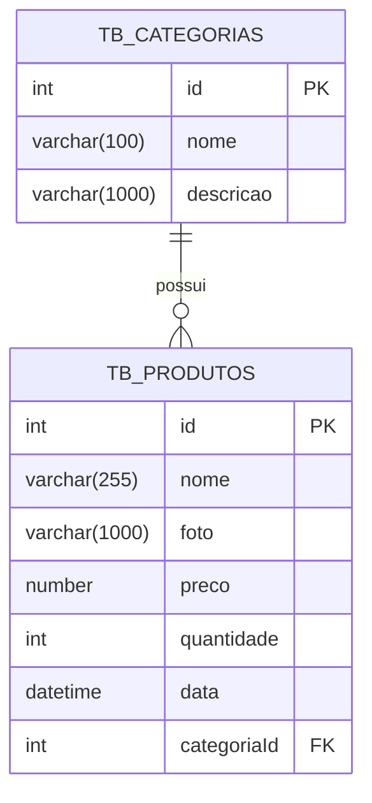

---

## ▶️ Como executar o projeto

### 📋 Pré-requisitos

1. **Node.js** (v18 ou superior)
2. **MySQL** (v8.0 ou superior)
3. Gerenciador de pacotes (**npm** ou **yarn**)

### 🚀 Passo a passo

1. Clone o repositório:

```bash
git clone https://github.com/SEU-USUARIO/Game_store.git
```

2. Entre na pasta:

```bash
cd Game-store
```

3. Instale as dependências:

```bash
npm install
```

4. Execute a aplicação em modo de desenvolvimento:

```bash
npm run start:dev
```

---

## 🧪 Testes da API (Insomnia)

Os testes da API foram realizados utilizando o **Insomnia**, validando todas as operações do CRUD para **Categorias** e **Produtos**, garantindo o correto funcionamento dos endpoints.

### 📂 Categorias

#### ✅ Listar todas as categorias

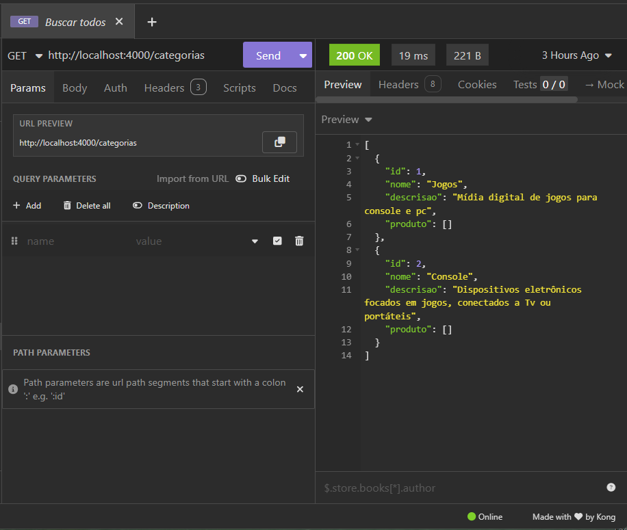

#### ✅ Buscar categoria por ID


#### ✅ Buscar categoria por nome

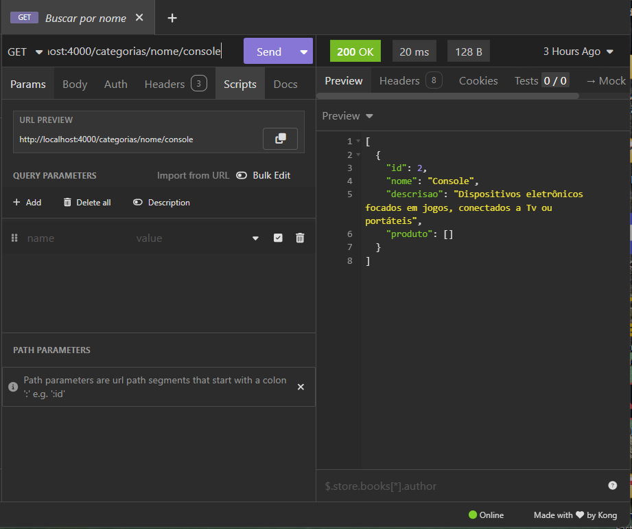

#### ✅ Criar nova categoria

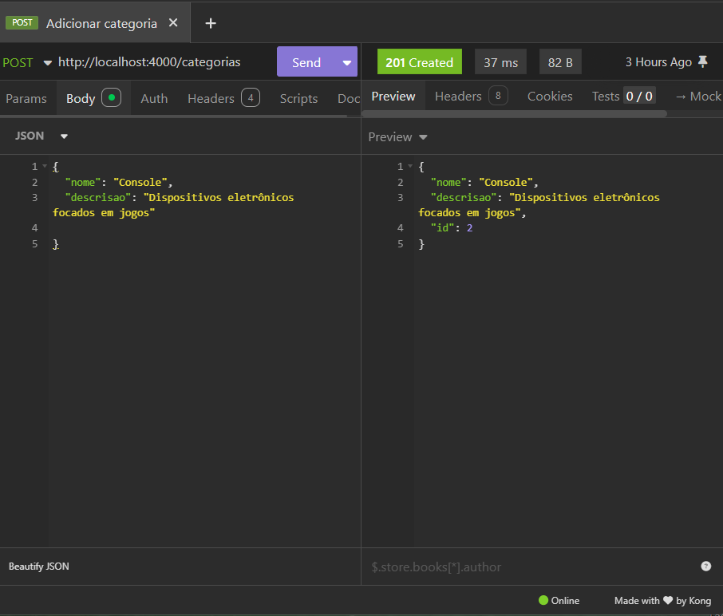

#### ✅ Atualizar categoria

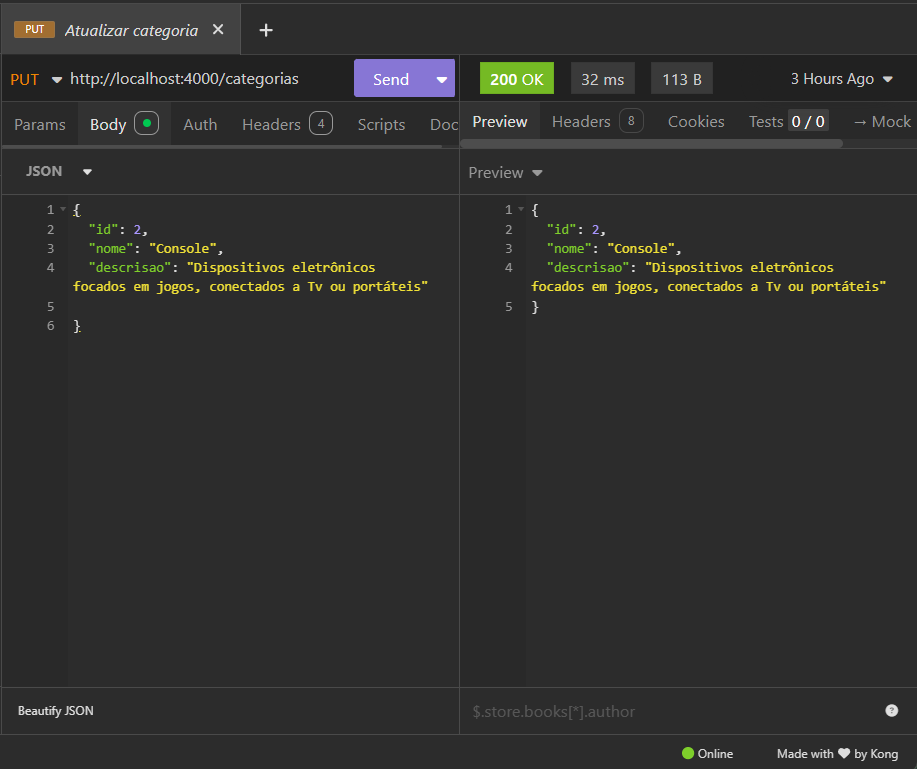

#### ✅ Deletar categoria

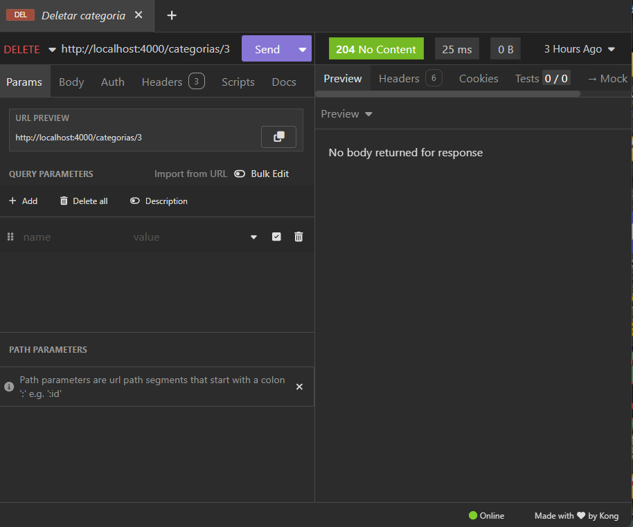

---

### 🎮 Produtos

#### ✅ Listar todos os produtos

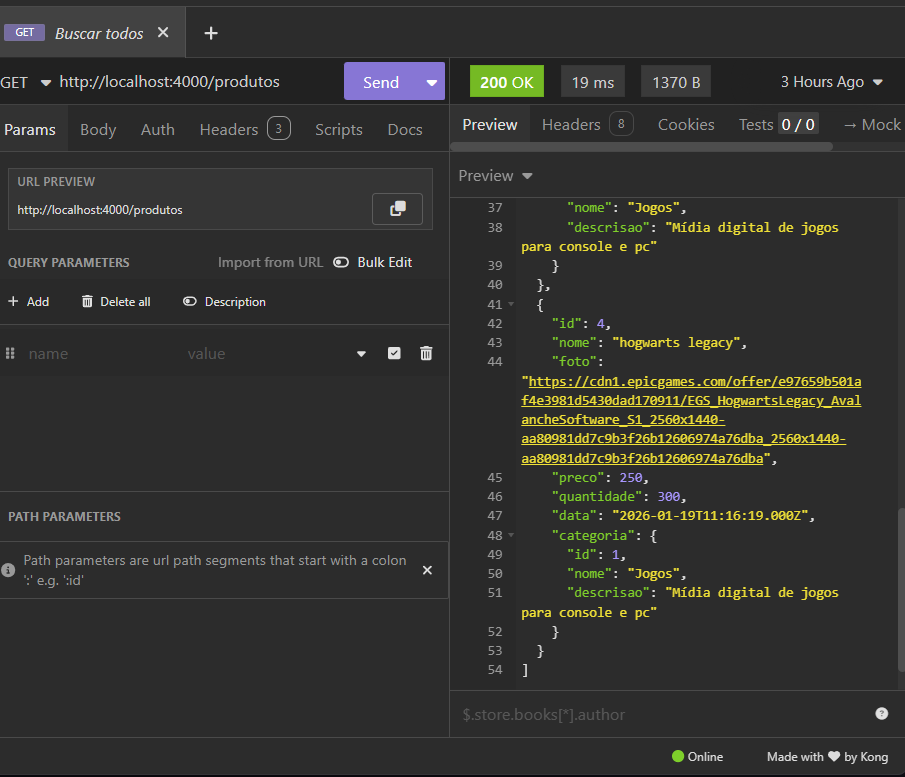

#### ✅ Buscar produto por ID

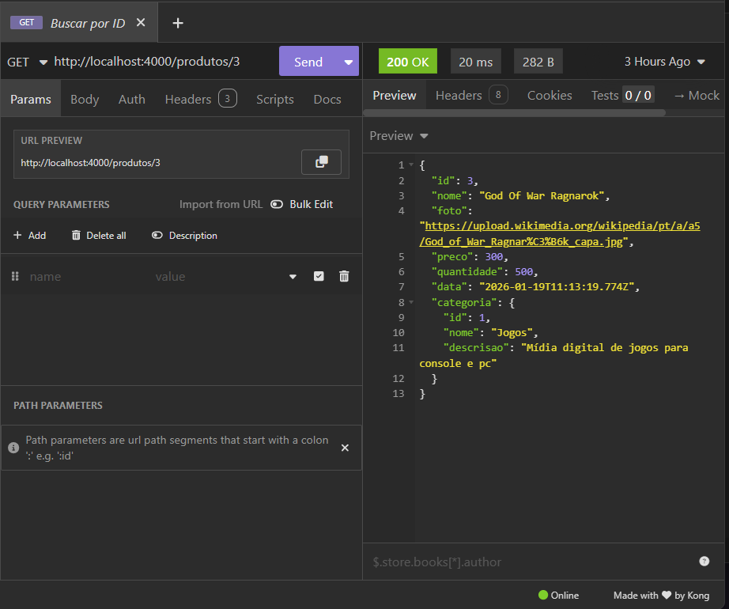

#### ✅ Buscar produto por nome

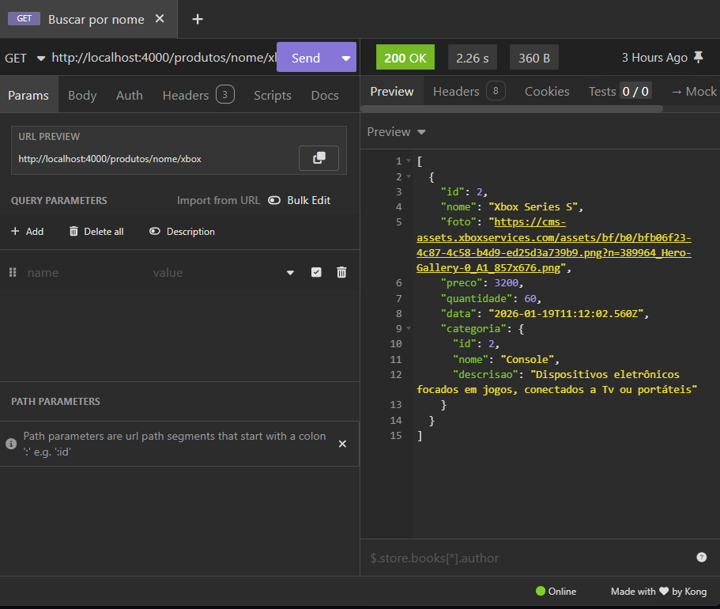

#### ✅ Criar novo produto

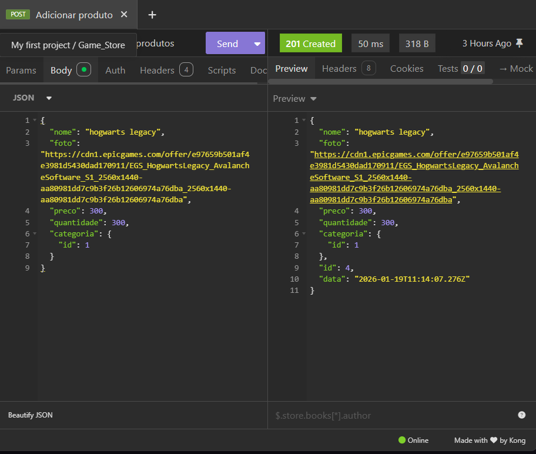

#### ✅ Atualizar produto

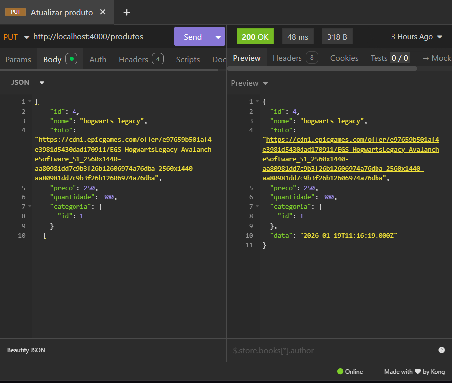

#### ✅ Deletar produto

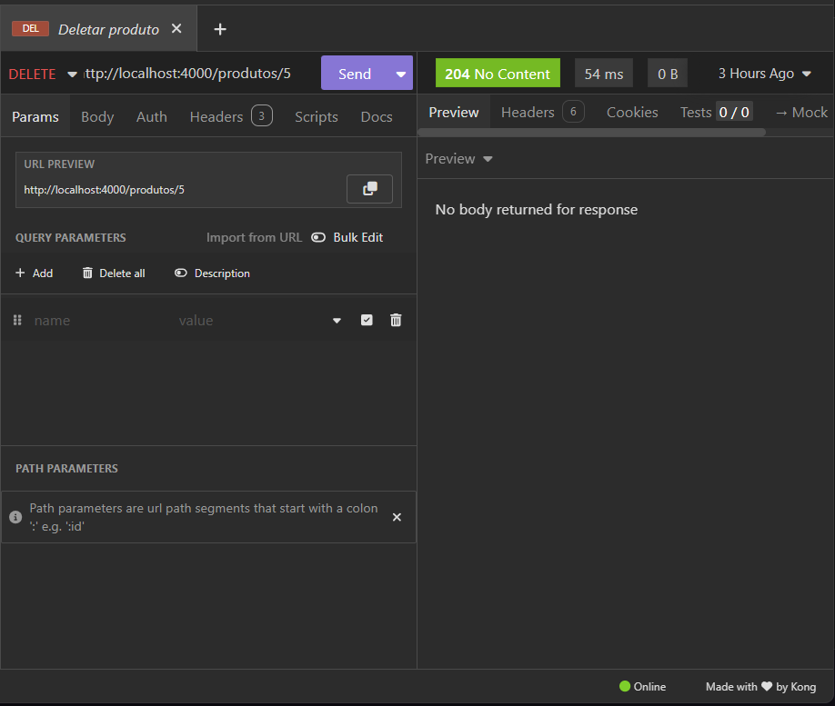

---

### 📂 Estrutura do Projeto

```bash
├── node_modules
├── src
│   ├── Categoria
│   │   ├── controllers
│   │   │   └── categoria.controller.ts
│   │   ├── entities
│   │   │   └── categoria.entity.ts
│   │   ├── services
│   │   │   └── categoria.service.ts
│   │   └── categoria.module.ts
│   ├── Produto
│   │   ├── controllers
│   │   │   └── produto.controller.ts
│   │   ├── entities
│   │   │   └── produto.entity.ts
│   │   ├── services
│   │   │   └── produto.service.ts
│   │   └── produto.module.ts
│   ├── app.controller.ts
│   ├── app.module.ts
│   ├── app.service.ts
│   └── main.ts
├── assets
│   └── insomnia
│        ├── categorias
│        │   ├── categorias-listar.png
│        │   ├── categorias-id.png
│        │   ├── categorias-post.png
│        │   ├── categorias-put.png
│        │   └── categorias-delete.png
│        └── produtos
│             ├── produtos-listar.png
│             ├── produtos-id.png
│             ├── produtos-nome.png
│             ├── produtos-post.png
│             ├── produtos-put.png
│             └── produtos-delete.png
├── test
├── .gitignore
├── .prettierrc
├── eslint.config.mjs
├── nest-cli.json
├── package.json
├── package-lock.json
├── README.md
├── tsconfig.build.json
└── tsconfig.json
```

---

## 📏 Boas Práticas e Padrões do Projeto

- Padrões de código
  - Siga o guia de estilo definido (ex.: ESLint, PEP8, SonarLint etc.).
  - Nomeie módulos e arquivos de forma clara e consistente.
- Commits
  - Use mensagens de commit descritivas.
  - Sugestão: padrão semântico (ex.: feat:, fix:, docs:, chore:).
- Testes - Escreva testes para novas funcionalidades.
  Não quebre testes existentes sem justificativa e atualização adequada.
- Logs e monitoramento
  - Use níveis de log adequados (info, warn, error, debug).
  - Evite logar dados sensíveis.

## 🤝 Como Contribuir

1. Faça um fork do repositório (se aplicável).
2. Crie uma branch descritiva:

```bash
git checkout -b feat/nome-da-funcionalidade
```

3. Implemente a funcionalidade ou correção, seguindo:
   - Padrões de código
   - Padrão de testes
4. Execute os testes antes de enviar:

```bash
npm test
```

5. Abra um Pull Request, descrevendo:
   - O problema resolvido ou funcionalidade criada.
   - Passos para testar.
   - Impactos em outras partes do sistema (se houver).

---

<table>
  <tr>
    <td align="center"><a href="https://www.linkedin.com/in/alberto-janeiro"><br /><sub><b>Alberto Durán</b></sub></a><br />❤️</td>
  </tr>
</table>
